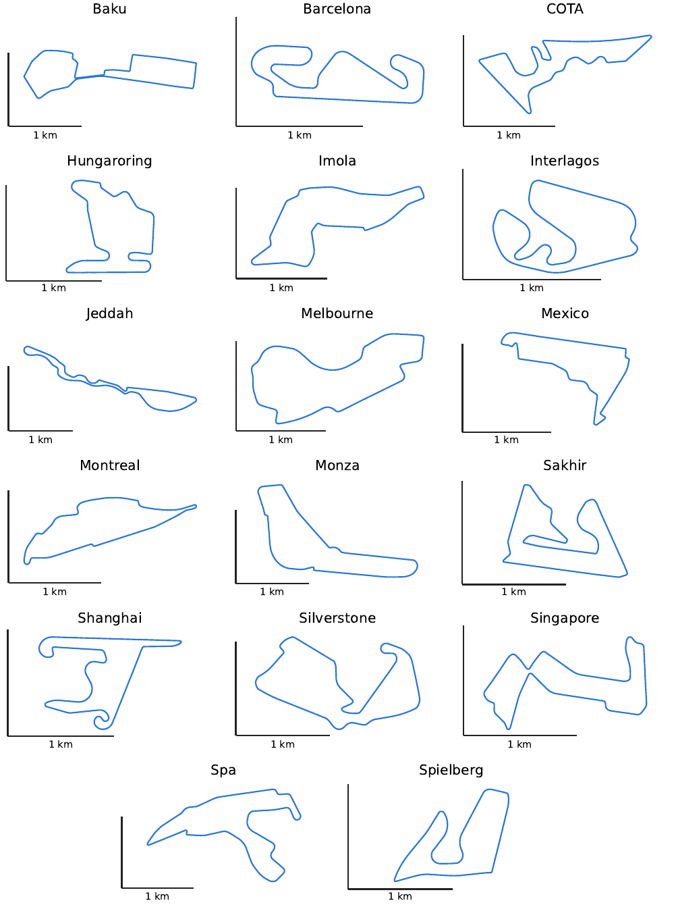
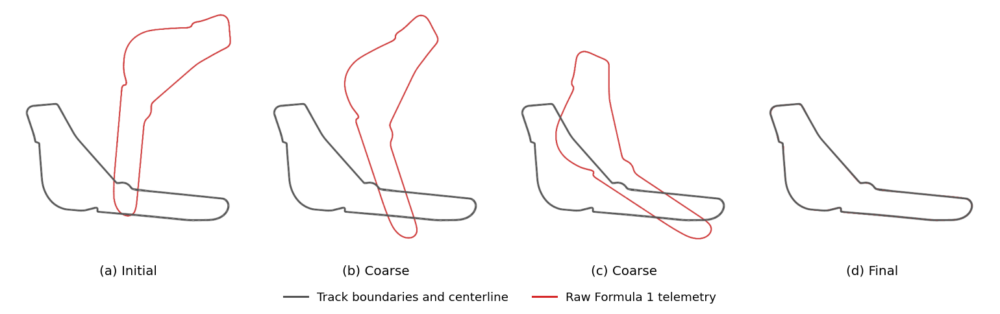
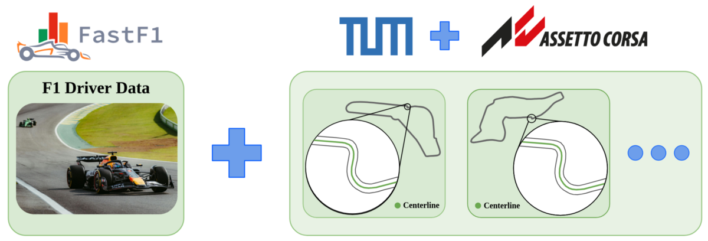

# Data

17 Formula 1 tracks with the expert raceline reconstructed from race telemetry, sampled every 2 m along the
track centerline. They are sorted into the split used for the released model
([`checkpoints/`](../checkpoints/README.md)):

| folder | tracks |
|---|---|
| `split_01/train/` | cota, hungaroring, imola, interlagos, jeddah, melbourne, montreal, monza, sakhir, shanghai, silverstone, singapore, spa, spielberg |
| `split_01/test/` | baku, barcelona, mexico (never seen by the released model) |

## Columns

| column | unit | meaning |
|---|---|---|
| `s_m` | m | distance along the centerline |
| `x_m`, `y_m` | m | centerline point |
| `kappa_radpm` | 1/m | centerline curvature, positive when the track turns left |
| `w_tr_right_m` | m | distance from the centerline to the right track edge, plus a 1 m margin (as used for training) |
| `w_tr_left_m` | m | distance from the centerline to the left track edge, plus a 1 m margin (as used for training) |
| `d_m` | m | expert F1 raceline: lateral offset from the centerline, positive to the right |

Points are ordered in driving direction and each track is a closed loop (the last point connects back to the
first; it is not repeated). The raceline in x/y is `centerline + d_m * right normal`. The F1 line comes from GPS
telemetry and can cross the track edges in places.

## How it was made

1. `scripts/download_telemetry.py` downloads a driver's race laps with FastF1.
2. `scripts/align_track.py` cleans the laps, aligns them to the track centerline, averages their lateral offsets
   into one raceline and resamples to 2 m.

See [`scripts/README.md`](../scripts/README.md) for both commands. The published files were made with an earlier,
more detailed version of this pipeline.

## Data sources and disclaimer

*Logos are those of the FastF1 project, the Technical University of Munich, and Assetto Corsa (Kunos Simulazioni),
and identify the source of each data stream; no affiliation or endorsement is implied. Photograph from Pexels.*

- **Telemetry:** the expert racelines (`d_m`) were derived from Formula 1 position telemetry accessed with the
  open-source [FastF1](https://github.com/theOehrly/Fast-F1) library (MIT), which retrieves it from the F1 live
  timing API. No raw telemetry is included; `scripts/download_telemetry.py` fetches it from the source.
- **Track geometry, 12 tracks** (baku, barcelona, cota, hungaroring, imola, interlagos, jeddah, melbourne, monza,
  shanghai, singapore, spielberg): derived from track models for the racing simulator Assetto Corsa (official and
  community-made content). Only derived centerlines and widths are included, no original track files.
- **Track geometry, 5 tracks** (mexico, montreal, sakhir, silverstone, spa): from the
  [TUM Racetrack Database](https://github.com/TUMFTM/racetrack-database) (LGPL-3.0).

This project is unofficial and is not associated in any way with the Formula 1 companies, with the developers or
publishers of Assetto Corsa, or with the authors of the tracks. F1, FORMULA ONE, FORMULA 1, FIA FORMULA ONE WORLD
CHAMPIONSHIP, GRAND PRIX and related marks are trade marks of Formula One Licensing B.V. Assetto Corsa is a
trademark of its respective owner. The processed data is provided for research use. The TUM-derived tracks remain
under LGPL-3.0.
