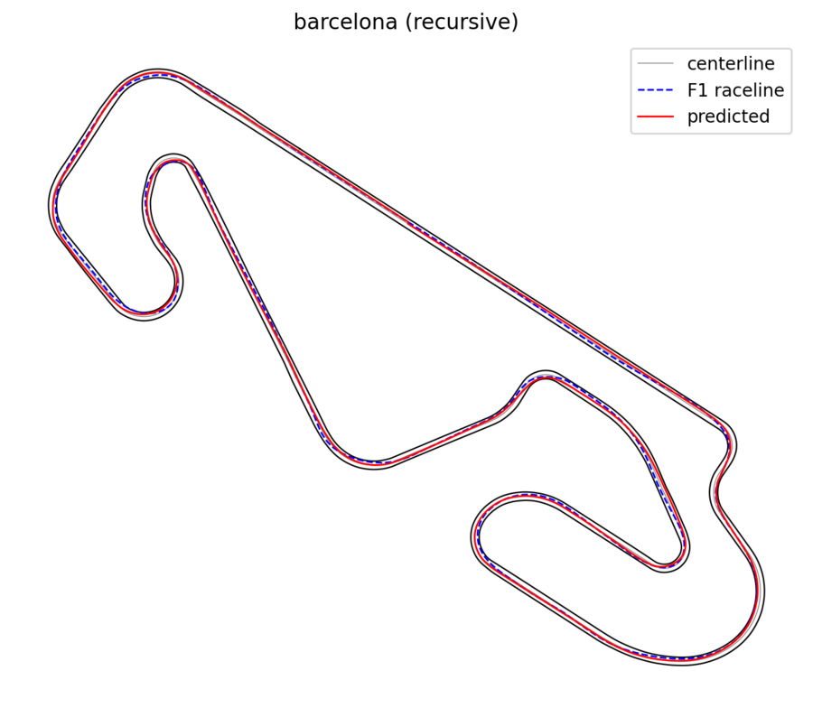

# Scripts

Run from the repository root. Every script prints its options with `--help`.

## predict.py

Predicts the raceline of a track, one lap, with a trained model.

```bash
python scripts/predict.py --track data/split_01/test/barcelona.csv --mode recursive --plot
```

- `--track`: CSV with `x_m, y_m, w_tr_right_m, w_tr_left_m`, points in driving direction
  (the format of [`data/`](../data/README.md) and of the TUM racetrack database). Other spacings are resampled to 2 m.
  The model was trained with track widths that include a 1 m margin on each side (see
  [`data/README.md`](../data/README.md)); for your own track, add 1 m to each real width.
- `--mode recursive` (default): the history starts on the centerline and is filled with the model's own predictions,
  as on a new track. `--mode non-recursive`: the history holds the true raceline `d_m` (needs a track with `d_m`).
- `--checkpoint`: model to use, default [`checkpoints/f1nn_split01_ep1500.pt`](../checkpoints/README.md).
- Output: `<track>_nn.csv` with `s_m, x_m, y_m, w_tr_right_m, w_tr_left_m, kappa_radpm, d_pred_m, raceline_x_m,
  raceline_y_m`, and with `--plot` a PNG of the track and the predicted line. If the track has `d_m`, the mean
  distance to it is printed.



## train.py

Trains a new model on the tracks in [`configs/train.yaml`](../configs/README.md).

```bash
python scripts/train.py --config configs/train.yaml
```

- `--epochs N` overrides the number of epochs, e.g. `--epochs 2` for a quick check.
- Prints training loss, validation loss and validation error in metres per epoch; saves `runs/split01/model_final.pt`.
- One epoch takes about 80 s on a laptop CPU; a GPU is recommended for the full 1500 epochs.

## download_telemetry.py

Downloads one driver's laps of a Formula 1 session with [FastF1](https://github.com/theOehrly/Fast-F1).

```bash
python scripts/download_telemetry.py --year 2025 --event "Italian Grand Prix" --driver VER --laps 1 4-12 --out telemetry/monza
```

- `--laps` takes lap numbers and ranges; `--session` defaults to the race (`R`); FastF1 caches downloads in `cache/`.
- Output: `telemetry/monza/lap01.csv`, ... with FastF1's telemetry columns (positions `X`, `Y` in 1/10 m).

## align_track.py

Turns downloaded laps into a raceline on a track.

```bash
python scripts/align_track.py --track data/split_01/train/monza.csv --telemetry telemetry/monza --out monza_aligned.csv --plot
```

- Cleans the laps (on-track samples only, metres), finds the rotation and translation that bring them onto the
  track centerline with a grid search, measures each lap's offset along the centerline normals and averages them.
- Output: a track CSV in the [`data/`](../data/README.md) format with the new `d_m`, and with `--plot` a
  before/after figure. Takes under a minute per track.
